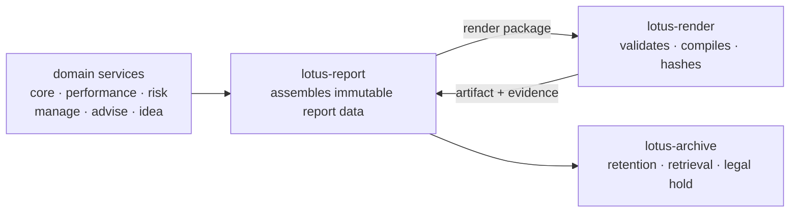
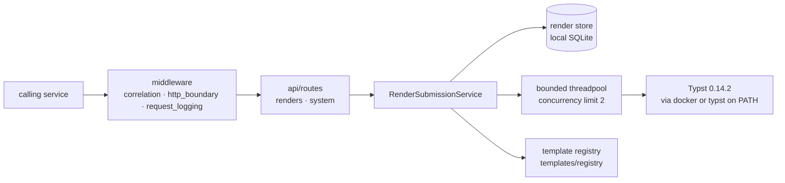

# Architecture

What `lotus-render` is, how a render actually executes, and what it deliberately does not do.
Measured against `main`; where something is a limitation rather than a design goal, it says so.

## What this service is

`lotus-render` turns a governed template plus caller-supplied data into a **PDF**. It is a
single-purpose rendering service with a deliberately small surface: **9 published operations**, of
which four are the render contract and five are operational.

```
POST /renders                                    submit a render
GET  /renders/{render_job_id}                    job status
GET  /renders/{render_job_id}/artifact-metadata  artifact identity and properties
GET  /renders/{render_job_id}/diagnostics        bounded lifecycle and failure detail

GET  /health  /health/live  /health/ready  /metadata  /metrics
```

It owns document *production*. It does not own the data in the document, the decision to produce it,
or where the result is filed afterwards — those belong to the calling service and to `lotus-archive`.

## Where a render fits

A document is produced by three services in sequence, each with a different authority:



The sequencing rule is the important part: **`lotus-report` calls `POST /renders` only once the
upstream data is already immutable and supportable.** A render is a presentation of a decision
already made, never a step in making it. That is what allows the render service to hold no domain
data and still produce an accountable document — everything worth disputing was settled before the
package was built.

The artifact returns to the caller inline; the durable home is `lotus-archive`. `lotus-render` keeps
job evidence, not documents.

## Runtime shape



Compilation is **blocking work**. It runs on a bounded threadpool rather than the event loop, which
is why `RENDER_EXECUTION_CONCURRENCY_LIMIT` is a real capacity control and not a tuning hint: it is
the number of documents this instance will compile at once.

## Job lifecycle

A render job moves through a small set of states, all of which a caller can observe:

| status | meaning |
|---|---|
| `accepted` | submitted and persisted, not yet compiling |
| `rendering` | compilation in progress |
| `rendered` | artifact produced |
| `failed` | compilation or validation failed; `diagnostics` carries a bounded reason |

Two conditions are often mistaken for job states and are not: `404 render_job_not_found` for an
unknown id, and `409 render_artifact_not_ready` when artifact metadata is requested before a
successful render. Neither is a lifecycle value — call diagnostics for the same id to find out where
the job actually is. See [API Surface](./API-Surface.md).

### Submission is idempotent

Re-submitting an existing job id does **not** start a second compile. `RenderSubmissionService`
returns the existing job when it is already `rendered` or `failed`, and equally when the record was
found rather than created. A caller that retries after a timeout gets the original outcome instead
of duplicate work — which matters because compiles are expensive and a duplicate would double the
load exactly when the service is already slow.

### Stale detection

Two windows decide when a job that is going nowhere becomes *visible* as such:
`STALE_ACCEPTED_SECONDS` (default 300) for a job accepted but never started, and
`STALE_RENDERING_SECONDS` (default 900) for a compile that has overrun. Without them a lost job
would simply sit. Keep both larger than `RENDER_COMPILE_TIMEOUT_SECONDS`, or healthy work is flagged
as stale — see [Configuration](./Configuration.md).

## State and durability

The render store is a **local SQLite file** (`data/render-store.sqlite3` by default), not a shared
database. Two consequences follow, and both matter when planning a deployment:

1. **A job's lifecycle is local to the instance that accepted it.** Another replica cannot answer for
   it. Route follow-up reads to the same instance, or run a single instance per store.
2. **Persistence is not enforced by default.** `REQUIRE_PERSISTENT_RENDER_STORE` is `false`, so a
   bare deployment can run against `:memory:` and lose accepted jobs on restart. The supplied Docker
   Compose file sets it `true` and mounts the store on a named volume; any deployment not using that
   file must set it deliberately — that turns the risky combination into a startup error rather than
   a silent one. Tracked as [#83](https://github.com/sgajbi/lotus-render/issues/83).

## Boundaries

The service deliberately does not own:

1. **the document's data** — the caller supplies it; `lotus-render` does not fetch domain state
2. **the decision to produce a document** — that belongs to the requesting workflow
3. **retention or distribution** — the artifact's durable home is `lotus-archive`
4. **template authorship** — governed separately, see [Template Registry](./Template-Registry.md)

## Current limitations

Recorded so that absent behaviour is not mistaken for behaviour that works.

| limitation | detail |
|---|---|
| **PDF only** | `SUPPORTED_OUTPUT_FORMATS` defaults to `("pdf",)` and a settings validator rejects any configuration omitting `pdf`. Another format is a code change, not configuration. |
| **Single-instance job visibility** | the render store is a local SQLite file, so one replica cannot report on another's jobs |
| **Persistence optional by default** | `REQUIRE_PERSISTENT_RENDER_STORE=false` permits `:memory:` and silent loss of accepted jobs on restart; Docker Compose overrides it to `true` — [#83](https://github.com/sgajbi/lotus-render/issues/83) |
| **Request-body cap needs a declared length** | the cap is enforced from `Content-Length`; a body with no declared length is not measured — [#84](https://github.com/sgajbi/lotus-render/issues/84) |
| **No recovery of stale jobs** | the stale windows make a lost job visible; nothing resubmits it — recovery is an operator action |
| **Engine must be present** | the runtime probe requires `docker` or `typst` on `PATH`; without one the service cannot compile |
| **Four code-health gates do not run in CI** | `complexity-gate`, `source-size-gate`, `dead-code-gate` and `dependency-hygiene-gate` are reachable only from `make check` / `make ci`, which no workflow invokes — tracked as [#80](https://github.com/sgajbi/lotus-render/issues/80) |

## Source map

| area | path |
|---|---|
| application composition | `src/app/main.py` |
| HTTP routes | `src/app/api/routes/` — `renders`, `system` |
| middleware | `src/app/middleware/` — `correlation`, `http_boundary`, `request_logging` |
| submission and lifecycle | `src/app/services/render_submission.py` |
| runtime probe | `src/app/services/render_runtime.py` |
| template domain | `src/app/domain/templates/` |
| public contracts | `src/app/contracts/` — `renders`, `system` |
| settings | `src/app/core/settings.py` |

## Read next

1. [API Surface](./API-Surface.md) — the nine operations and their contracts
2. [Configuration](./Configuration.md) — every setting and its default
3. [Template Registry](./Template-Registry.md) — template rules and the active set
4. [Operations](./Operations.md) — health, diagnostics and metrics
